# SIEM Project User Manual

> [!NOTE]
> Just some mock User Manual

## Table of Contents

1. [Introduction](#introduction)
2. [Getting Started](#getting-started)
3. [Dashboard Overview](#dashboard-overview)
4. [Log Analysis](#log-analysis)
5. [Alert Management](#alert-management)
6. [Reporting](#reporting)
7. [User Administration](#user-administration)
8. [Troubleshooting](#troubleshooting)

## Introduction

Welcome to the SIEM (Security Information and Event Management) system. This manual will guide you through the features and functionalities of our SIEM solution.

## Getting Started

1. Access the SIEM web interface at: https://i14-ssiem.com
   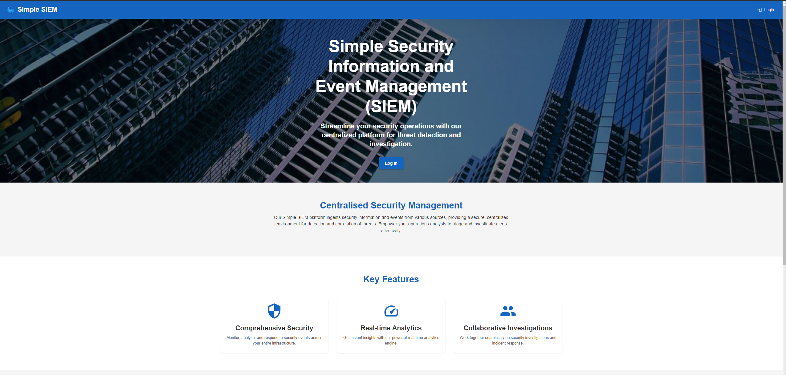
2. Log in using your provided credentials.
   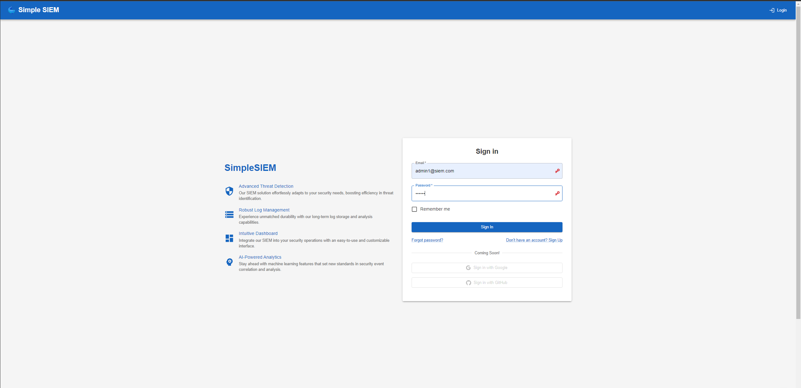
3. Upon first login, you'll be greeted with the dashboard.

## Dashboard Overview

The dashboard provides a high-level overview of your security posture:
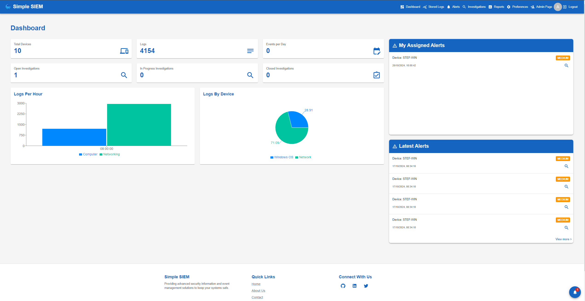

### Dashboard Cards

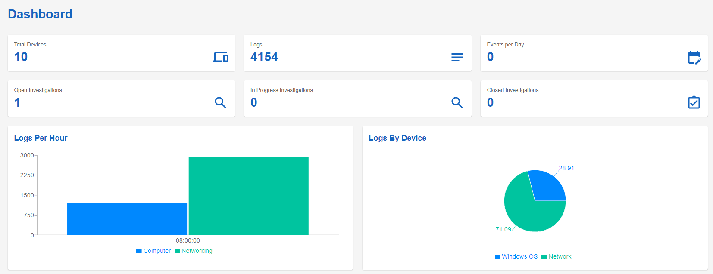

- Total Devices: shows how many different devices have generated logs.
- Logs: Card shows how many logs are currently stores within the SSIEM. Clickable to navigate to the stored logs page.
- Events per Day: Shows the number of alerts that have been genrated in the past 24 hours. Clickable to navigate to the alerts page.
- Open Investigations: Shows the number of currently open investigations. Clickable to navigate to the Investigations page.
- In Progress Investigations: Shows the number of currently in progress investigations. Clickable to navigate to the Investigations page.
- Closed Investigations: shows the number of closed investigations. Clickable to navigate to the Investigations page.
- Logs Per Hour Hour: Shows the number of alerts that have been generated per hour in a 24 hour timeline.
- Logs by Device: Demonstrates the portion of logs generated by device.

### Alert Lists

- My Assigned Alerts: Shows the currently logged in user the alerts that they have been assigned. Clicking on the alert will open a pop-up window to show more details.

  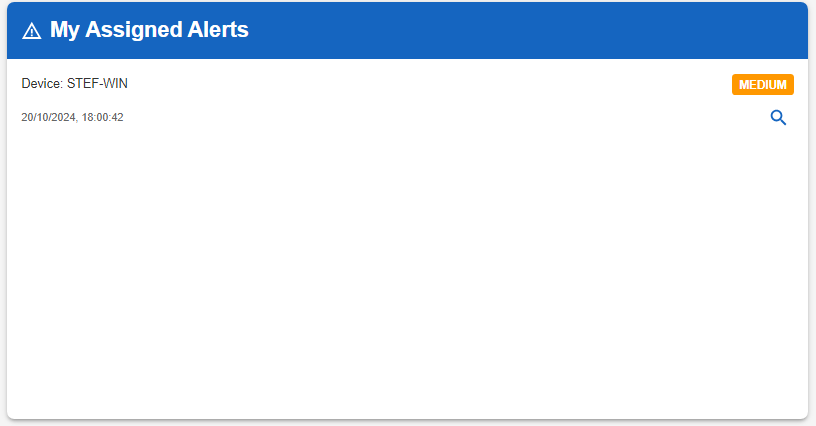

- Latest Alerts: Shows the latest alerts that have been generated by the application they have not been assigned to a user.

  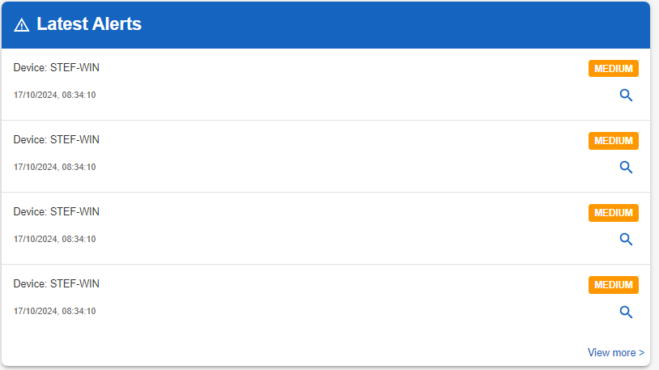

## Log Queries

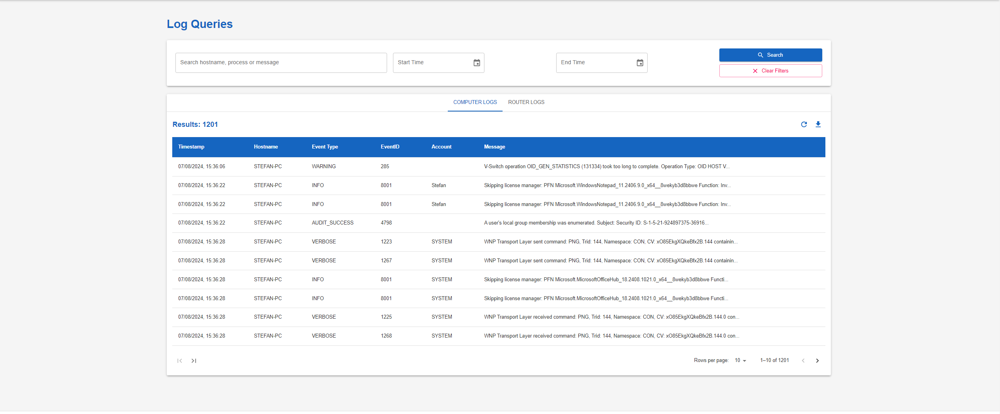

1. Navigate to the "Stored Logs" section via the Navigation bar
2. Use filters to narrow down log entries:
   - Time range
   - Log source: Computer and Router logs are stored in two different sections to allow for simpler searching.
   - Increase the number of entries visable on one page.
3. Click on a log entry to view details
4. Use the search function for specific keywords or values

Advanced features:

- Export log data for offline analysis

## Alert Management

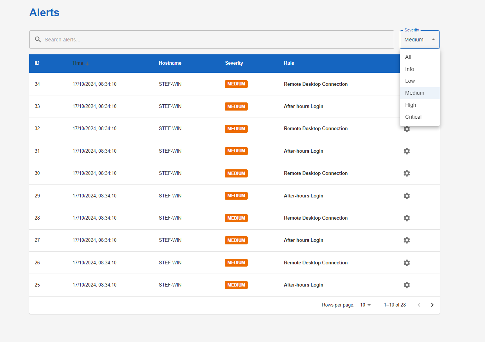

1. Access the "Alerts" section from the main menu
2. View list of active alerts, sorted by priority
3. Click an alert to see details and take action:
   - Assign to team member
   - Change status (e.g., In Progress, Resolved)
   - Add notes or comments
     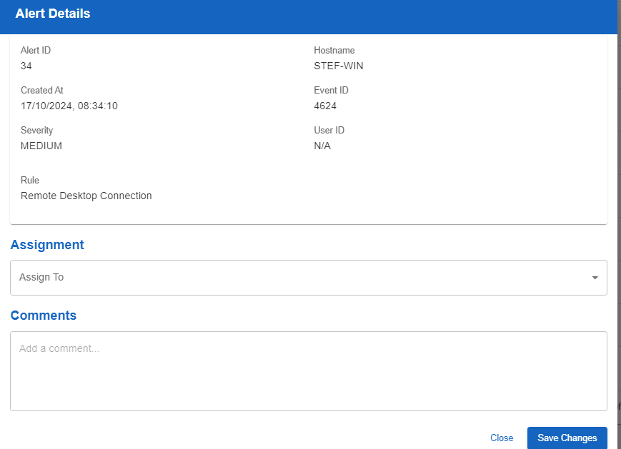
4. Use filters to focus on specific alert types or timeframes

## Investigations

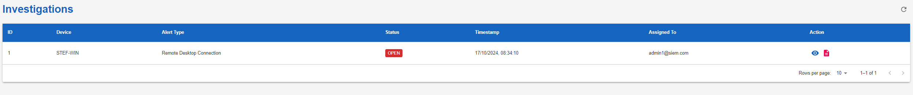

1. Navigate to "Investigations" section via the navigation bar.
2. Click on the eye icon for the Investigation that you have been assigned to view more details about the alert.

   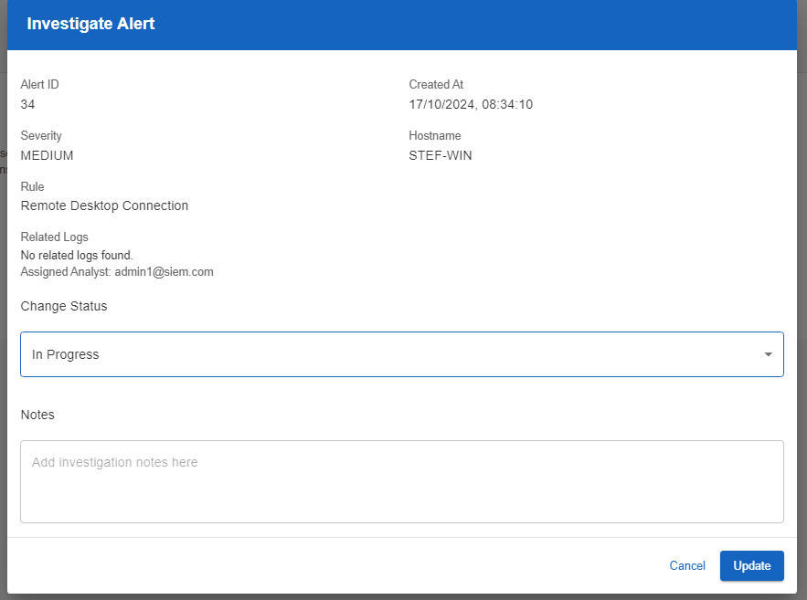

3. Change the status to in progress once investigations began
4. Write about ur investigation as you proceed.
5. Click on the Document icon to autofill fields that are required for the creation of a report once the investigation is complete.

   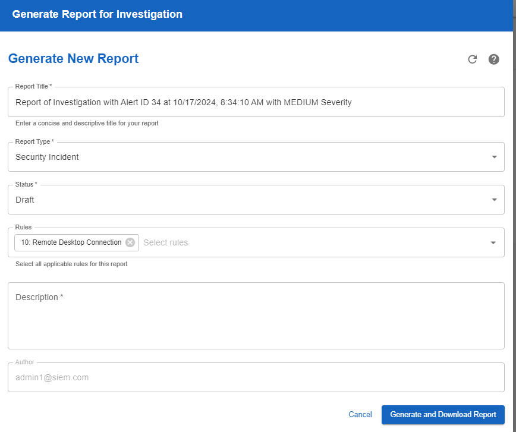

## Reporting

1. Go to the "Reports" section
2. Choose from pre-defined report templates or create a custom report

   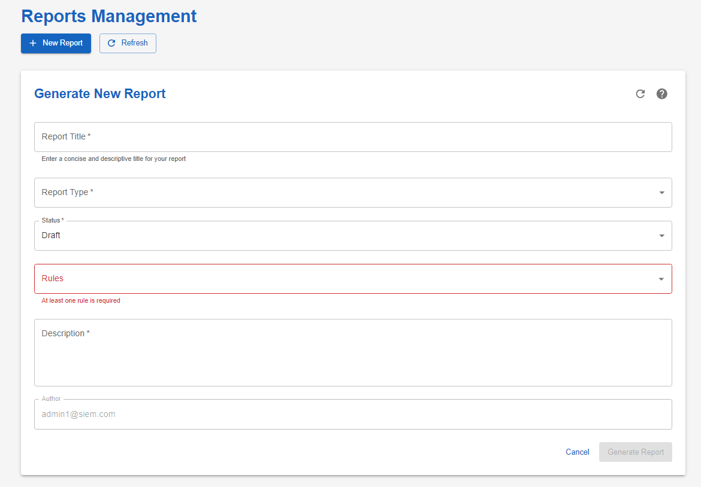

3. Set parameters (time range, data sources, etc.)
4. Generate report in various formats (PDF, CSV, HTML)
5. View Generated reports

## Prefernces

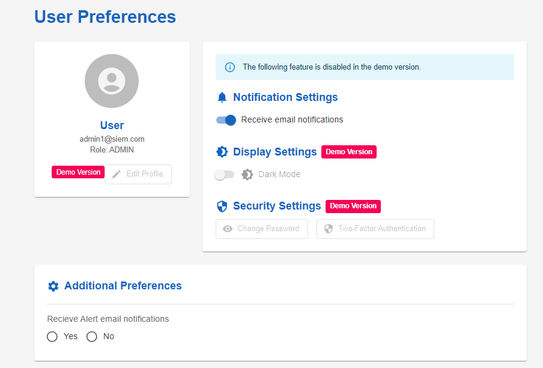

1. Go to Preferences page via the navigation bar.
2. View the detials of the user logged in.

## User Administration

For users with administrative privileges:

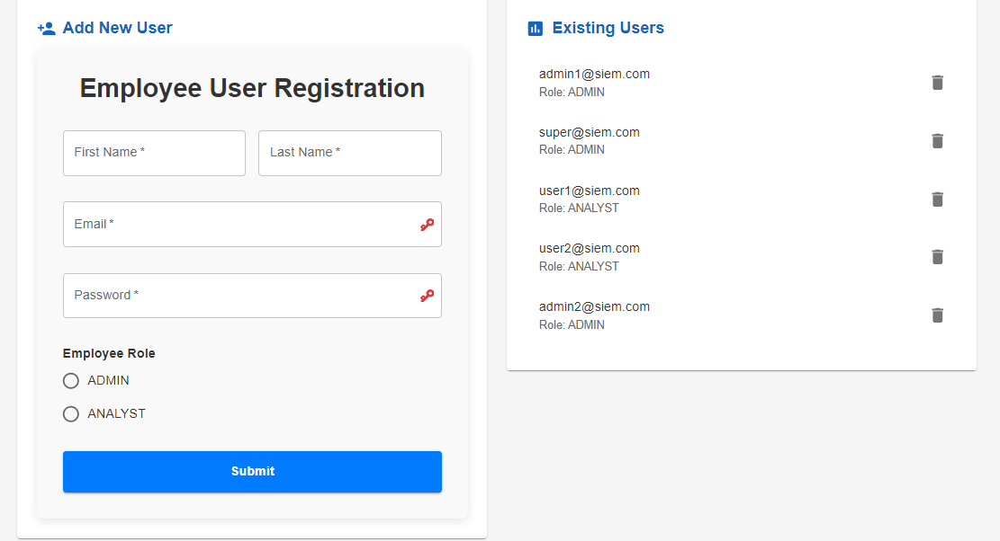

1. Access "Admin" section
2. Manage user accounts:
   - Create new users
   - Deleate User accounts
   - Modify user roles and permissions
   - Reset passwords
3. Configure system settings:
   - Log retention policies
   - Alert rules
   - Integration with external systems

## Troubleshooting

Common issues and solutions:

- No data in dashboard: Check log source connections
- Slow performance: Try narrowing time ranges for queries
- Login issues: Verify network connectivity and user account status
